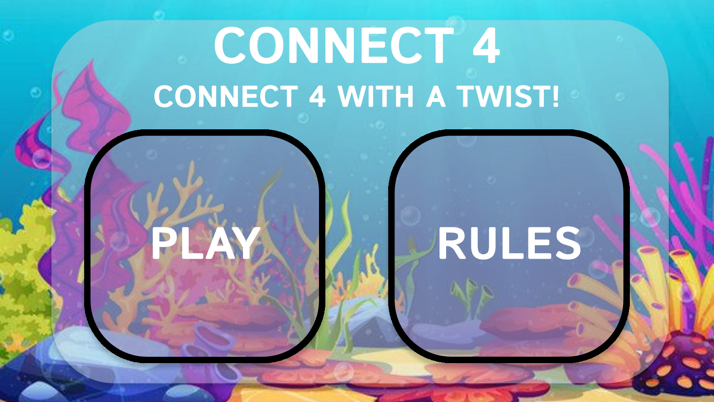
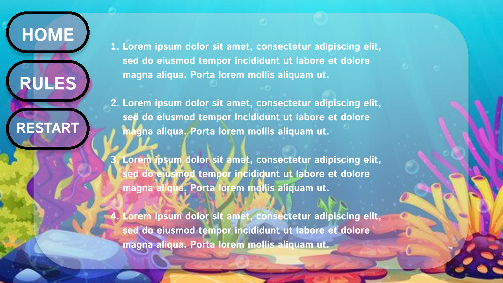
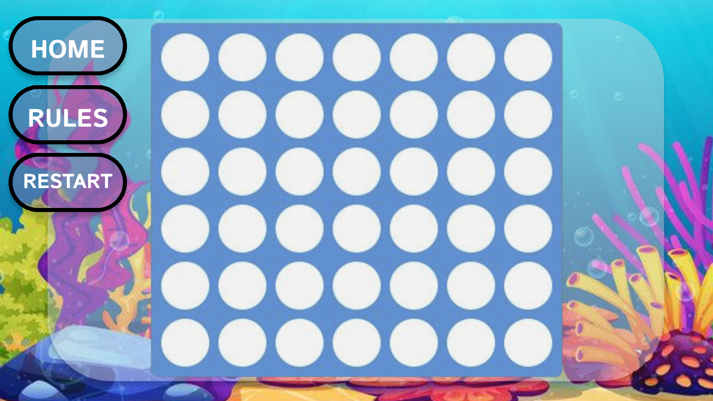
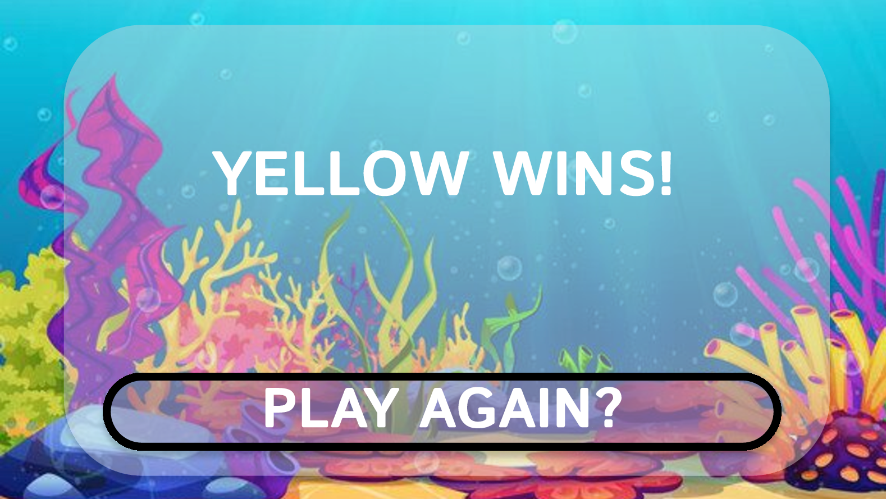

# **Connect 4**

## **Site Overview**

Connect 4 is a two-player abstract strategy game where the objective is to be the first to form a line of four of one's own colored discs (either vertically, horizontally, or diagonally) on a grid.

The purpose of this site was to be a online version on Connect 4 aimed toward a younger audience.

Please find the live site via the following URL - https://lukethornton92.github.io/Milestone-Project-2-C4/

## Table of contents:

1. [**Site Overview**](#site-overview)
2. [**Planning stage**](#planning-stage)
   - [**_Target Audiences_**](#target-audiences)
   - [**_User Stories_**](#user-stories)
   - [**_Site Aims_**](#site-aims)
   - [**_How Will This Be Achieved_**](#how-will-this-be-achieved)
   - [**_Research_**](#research)
   - [**_Wireframes_**](#wireframes)
3. [**Building Stage**](#building-stage)
   - [**_Colour Scheme_**](#colour-scheme)
   - [**_Typography_**](#typography)
4. [**Features**](#features)
5. [**Future Enhancements**](#future-enhancements)
6. [**Testing**](#testing)
   - [**_Validator Testing_**](#validator testing)
7. [**Deployment**](#deployment)
8. [**Credits**](#credits)
   - [**_Honourable Mentions_**](#honourable-mentions)
   - [**_General Reference_**](#general-refrence)
   - [**_Content_**](#content)
   - [**_Media_**](#media)

---

## **Planning Stage**

### **Target Audiences:**

- Users will be predominantly children.
- Users looking to spend sometime playing a fun, simple game.
- Users looking to challenge a friend.
- Users looking for a fun twist on a classic game.

### **User Stories:**

- As a user, I want to have an entertaining experience.
- As a user, I want to under stand the rules of the game quickly and easily.
- As a user, I want the site to have big and clear buttons for navigation.
- As a user, I want the site to be accessible to all ages and abilities.
- As a user, I want to be able to play the game on all possible devices.

### **Site Aims:**

- To be intuitive to use, especially for a younger audience.
- To be visually appealing, running with a theme such as Space/Ocean/Jungle.
- To have a clear UI, to be easily navigated without any "dead ends".
- To be fun.
- To be a interesting take on an tried and tested game.

### **How Will This Be Achieved:**

- The site will have bold vibrant colours.
- Large eye catching buttons with clear indication of purpose.
- The site will be optimized for mobile play.
- The site will be easy to read.

### **Research:**

After spending sometime researching current sites that have connect 4 I noticed a wide variety of techniques and styles.

The sites I viewed were:

**1. https://www.cbc.ca/kids/games/all/connect-4**

This was the best example of connect 4 I found during my search, it has all the elements I wish to include in my own work, its not perfect and could be improved with better sound controls (music kicks in as soon as the page opens and is very loud) and overall position isn't ideal.

The key lessons I've gathered from this site are:

- Animations, both the selection of the column and the drop animation.
- Avoid loud noises that play as soon as you start the game.
- Player v Player and Player v computer available.

---

**2. https://papergames.io/en/connect4**

This is a good version, I like the fact you can modify the board size (number of cols and rows) which was an idea I originally had myself. Its not as clean as as the first site but still looks clean and professional.

The key lessons I've gathered from this site are:

- Before game starts you can modify the board and other settings.
- The game is originally aimed at 2 human players playing on different computers.
- Simple UI can still look good.

---

**3. https://boardgames.io/en/connect4**

This version only allows online player v player, which is good if someone is sat in a lobby waiting to play. doesn't allow any modification, no player v player on local play and a very basic/ugly UI.

The key lessons I've gathered from this site are:

- Need to have a welcome/home screen.
- Need local play
- Colour plays a key role, using white and grey feel very cold.

---

**4. https://www.mathsisfun.com/games/connect4.html**

This is the simplest site I found, the actualy game sits in a small window within the site which allows the user to scrolls down which could be done by accident. Once you scroll down you can see the rules and a short paragraph about the history of the game.

The key lessons I've gathered from this site are:

- Game needs to be larger, as big as possible.
- Try and keep it to one page, avoid users scrolling.
- Colour palette plays a key role in the attraction to the game.

---

With these observations I was ready to start designing my wireframes.

### **Wireframes:**

To organize my thoughts and prevent scope creep, I created a wire frame for this project. Below are links to each of the mobile and desktop versions of the site.

I have shown 2 different themes for the mobile desktop versions, please toggle the following dropdowns to view the wireframe images.

#### **Mobile Wireframes:**

   

Mobile Home Screen

   
   

   

Mobile Rules Screen

   
   

   

Mobile Game Screen

   
   

   

Mobile Winner Screen

   
   

#### **Desktop Wireframes:**

   

Desktop Home Screen

   
   

   

Desktop Rules Screen

   
   

   

Desktop Game Screen

   
   

   

Desktop Winner Screen

   
   

---

## **Building Stage**

My goal is to bring an element to a new element to connect 4 that warrants it being in a digital format, my current idea is to implement a 'Tetris' style column clear every time you score a 4 in a row. This would bring another level of tactics to the game as you would need to account for points earned and the consequence of scoring and modifying the board.

I want to build this site focusing on the basics of Connect 4 first, then slowly implementing the things i've highlighted from my research. This way if I run into any issues I can fall back on a solid working game.

### **Colour Scheme And Theme:**

Knowing this site is aimed at children I wanted to focus on a colour scheme that would be lively enough to capture the attention of a younger audience, while also maintaining a nice user experience for all ages. The first thing I wanted to ensure was a visually stimulating and themed background, as my intention was for the theme to be easily customisable to fit a range of potential topics.

My first idea was a ocean theme, but after searching for potential backgrounds online I couldn't find anything that really stuck out, so after review some other potential themes such as forests and beaches I settled on space as it is a personal interest of mine.

After a little hunting and refining my search I found something [perfect](https://www.vecteezy.com/vector-art/1110375-stars-and-planets-in-outer-space), something that would pop with colour against a dark (not black) background and with a drawn aesthetic. From this image I was able to pick out my darker tones but I was still in search of 2 contrasting lighter tones that would complement the game. Connect 4 is classically played with Red tiles and Yellow tiles, so after a little while playing with the varying shades and tones I was able to find 2 that I personally liked and that worked well against the backdrop, completing my colour scheme.

### **Typography**

After doing a little research into fonts, I found a useful [article](https://varrojoanna.com/the-easiest-fonts-for-kids-to-read/) talking about children and the fonts they find easiest to read, seeing as this game is aimed at a younger audience I thought it best to ensure that children were the focus when it came to the typography. I chose to use googles 'Andika' after reviewing all the recommendations, I felt this was the best middle ground for young and older players.

Titles use a font weight of 700 for a bigger bolder title, while the rules section uses the standard weight. The buttons use a weight of 600 to give it a little more weight than any paragraphs.

Given limited amount of text I felt Andika was good enough to cover all possible uses, if for some reason it isn't available font family will default to Helvetica and then sans-serif.

- All fonts were sourced from Google fonts, as stated in the credits.

---

## **Features**

Below are some of the features currently within the site.

### **Home Page:**

### **Wallpaper and Back-panel:**

### **Hiding Pages:**

### **Buttons:**

### **Swap Sides:**

### **Rules:**

### **Modal:**

### **The Game:**

### **Winner:**

### **Draw:**

### **Restart:**

### **404:**

---

## **Testing**

### **Validator Testing:**

#### **CSS:**

After running the site through the CSS validator I got no errors.

#### **HTML:**

After running the site through the HTML validator I got 5 errors.

- 2 errors for the 2 home page buttons, the text was sat within a H2 tag. This has now been changed to the text sitting within the button and a new class being made that overrides the generic buttons styling.

- 2 errors for unclosed div's, throughout the build process I had been moving parts around to change how they appear, in this process I had accidentally removed some div's closing tags. This has been resolved and the site was unaffected.

- The final error for the body resolved itself once the above was fixed and retested.

#### **Javascript:**

### **LightHouse Testing:**

Using the LightHouse in my Google DevTools I was able to optimise my website for Performance, Accessibility, SEA and best practices.

---

## **Future-Enhancements**

The following is a list of future enhancements that I would like to implement given more time and/or knowledge.

- A change in theme, as shown in my initial wireframes I was interested in the idea of changing the overall theme depending on the users preference. This would include the background image them being selected from a number of natural scenes and the colour of the tiles being selected from a colour wheel from the rules/settings menu.

- I spent a long time trying to implement the tiles being meteors, I was really trying to avoid having a connect 4 board just sat on top of a background.

- Given more time and skill I would have liked to modify the board its self so it sat behind a themed image, so it looked like the board was part of the theme. With the current space theme if could have been made of rockets or made to look like a space station.

- If I was looking to release this website to be played between friends I would like to introduce a way of playing with a friend on a different machine, so the 2 players wouldn't need to share a screen, this was something I noticed during my research.

- Animation, I would like to implement 2 forms of animation, one being a drop animation that would simulate a tile piece falling, the other being the tile floating about the board following a curser or finger. I feel this would help add a sense of realism and it is one of the few physical elements to the game, which could feel lost on the digital format.

## **Deployment**

The site was deployed to GitHub pages. The steps to deploy are as follows:

- From this project's repository, navigate to the settings tab

- From the left hand menu, select pages.

- From the source section drop-down menu, select the Main Branch.

- Once the main branch has been selected, the page will refresh and provide a link to the live project.

You can find the live site via the following URL - https://lukethornton92.github.io/Milestone-Project-2-C4/

---

## **Credits**

### **Honorable Mentions:**

This project could not have happened without the support of the following people listed in no particular order:

-

### **General Reference:**

- The project was influenced by the Code Institutes code along project called Love running. Whilst I have tried to deviate as much as possible there may be some similarities in the code.
- I relied upon W3schools, ChatGPT and stack overflow for general references throughout the project.

### **Content:**

- All content was written by myself

### **Media:**

-
